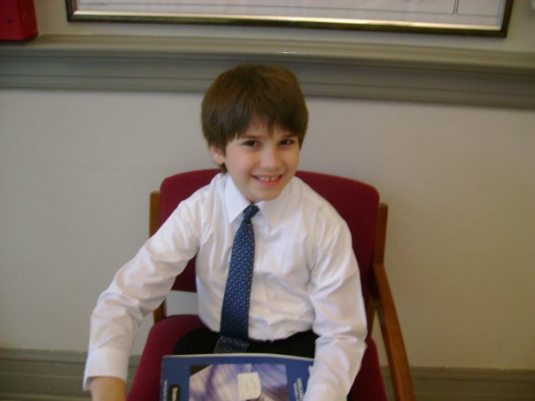
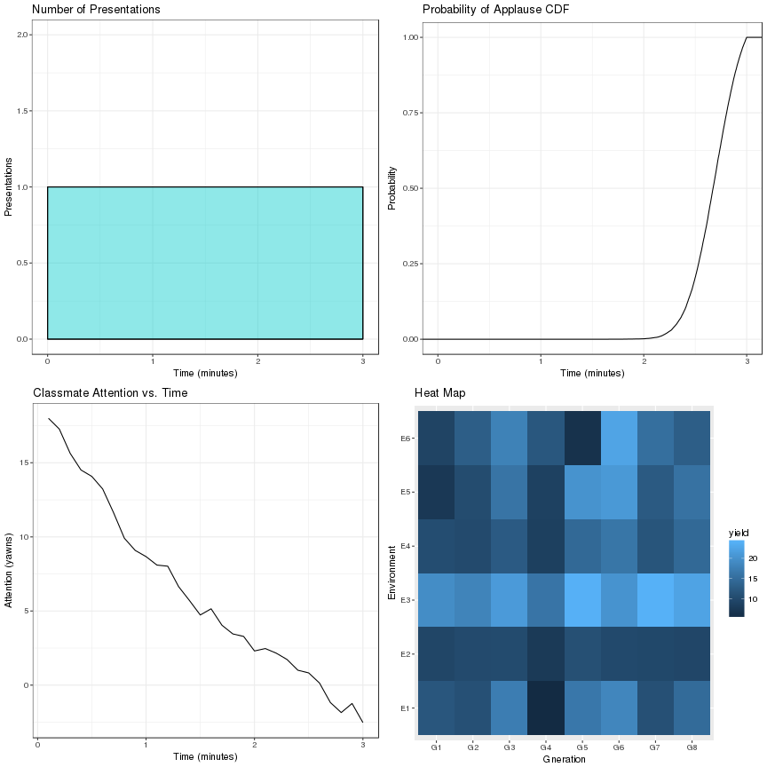
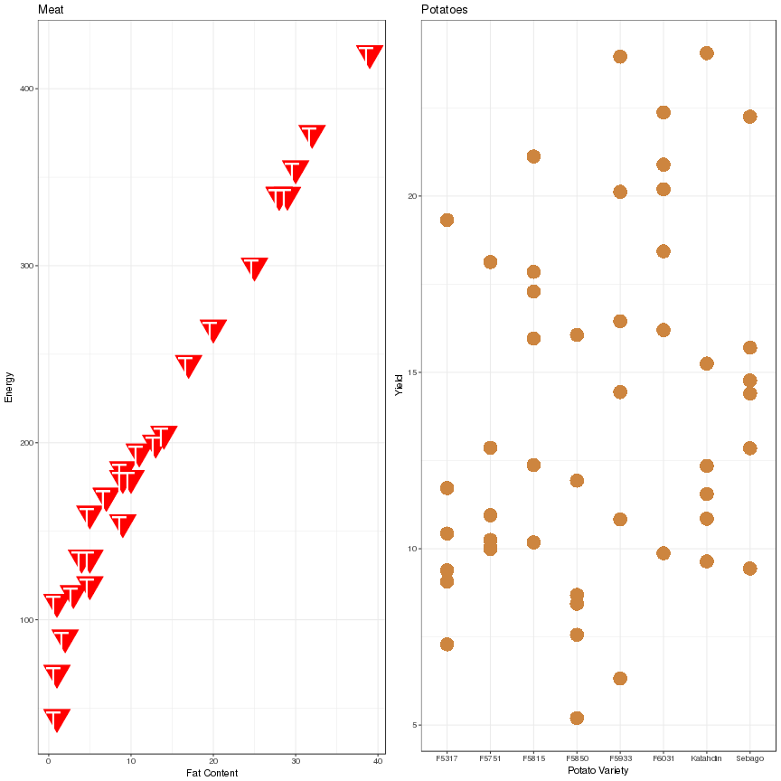
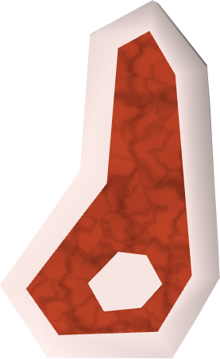
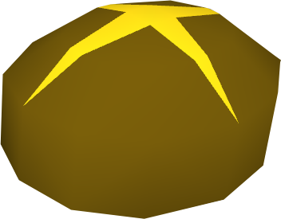
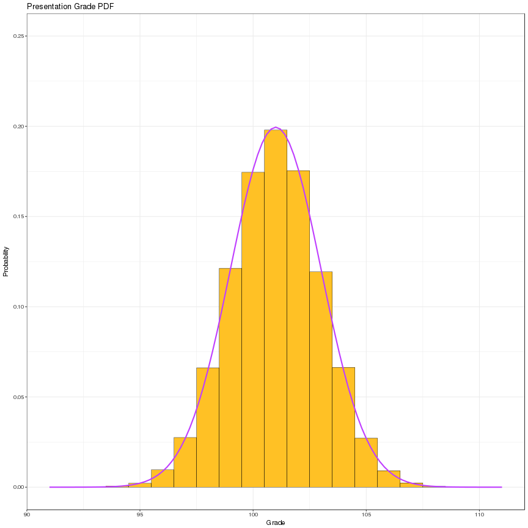

Presentation Presentation
========================================================
author: Matt McCaskey
autosize: true

Introduction
========================================================

I rigorously collected and fabricated data on my own presentation.

This is a brief compilation of my most eye-opening findings.

***

"Interesting"" Plots
========================================================

  

***
- As you can see, these plots are in my presentation.

- There are four of them

- Don't they look nice?

Meat and Potatoes
========================================================
left:60%

***

Fascinating

Presentation Grading
========================================================

What Have We Learned??
========================================================
- ggplot
  - geoms
  - aesthetics
  - functions
  - scaling
  - themes
  
- The true meaning of Christmas
