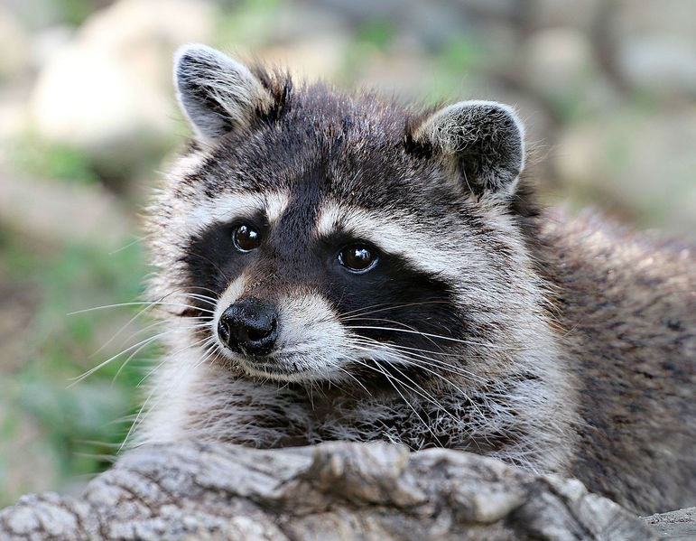

```{r setup, include=FALSE}
knitr::opts_chunk$set(echo = TRUE)
```


I am a firm believer that everyone should care about me. Here is a picture of me.

```{r, echo=FALSE}
library(knitr)

```

Here's a link to my [linkedin](https://www.linkedin.com/in/matt-mccaskey-b4882b14b/) account.